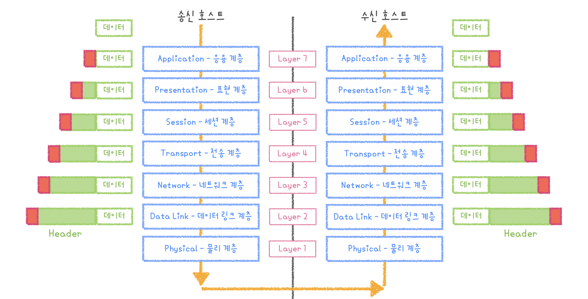
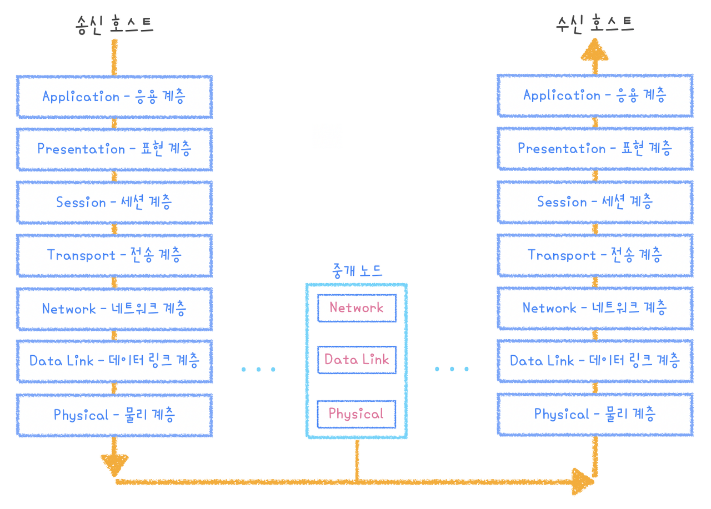
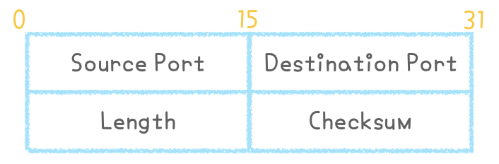
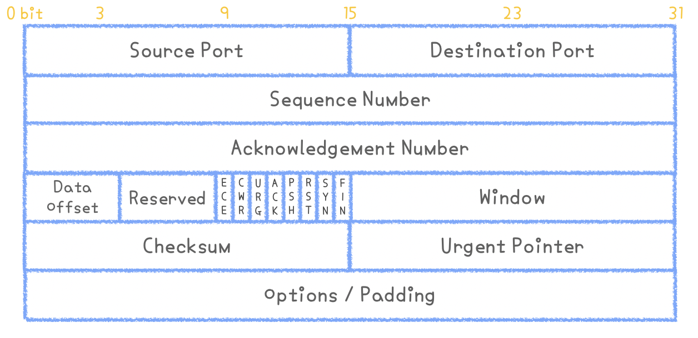

# OSI 7계층

오늘은 네트워크 공부에서 빠질 수 없는 **OSI 7계층**에 대해서 알아보려 합니다. 솔직히 OSI 7계층에 뭐가 있는지, 각 계층의 역할이 뭔지 그냥 단순히 암기하기에는 내용이 많기도 해서 암기한답시고 단순하게 공부해놓으면 나중에 헷갈릴 때가 많습니다.

 

그리고 저는 단순암기보다 이해를 해야 기억에 더 잘 남는 편이라.. 이번에는 동작방식을 하나씩 따라가보며 이해해보려고 합니다...😄

<br />
<br />
 
## 먼저, OSI 7계층이 뭘까요??
말 그대로 **네트워크에서 통신이 일어나는 과정을 7단계로 나눈 것**을 말합니다.

*도대체 왜 나눴을까요? 우리의 공부량을 더 늘이기 위해서는 아니겠죠?* 이렇게 계층을 나눈 이유는 **통신이 일어나는 과정을 단계별로 파악**할 수 있도록 하기 위함입니다. 7단계 중 특정단계에서 이상이 생기면 다른 단계의 장비 및 소프트웨어를 건들이지 않고도 이상이 생긴 단계만 체크해보면 되니까 문제가 발생된 범위를 줄일 수 있고, **단계별로 흐름을 한 눈에 파악**하기도 쉬워집니다.

<br />

### 한 번 예시를 들어볼까요?

PC방에서 오버워치를 하고 있는데 갑자기 연결이 끊기는 화나는 상황이 발생했습니다.

```
1. 주변을 둘러보니 👥모든 사람들👥의 PC가 다 끊겼네요??
그럼 여기서 추측할 수 있는 상황은 라우터의 문제(3계층)이거나 광랜을 제공하는 회사의 회선 문제(1계층)일 수 있습니다.

 

2. 주변을 둘러보니 다른 사람들은 게임을 잘 하고 있어요. 나만 끊긴거죠!!🤯
    * 근데 보니까 오버워치 소프트웨어에는 문제가 없는 거 같은데..... 스위치에 문제가 있나..? 하면 2계층에 문제가 있을 확률이 높죠
    * 근데 오버워치 소프트웨어에 문제가 있는 거 같다? 그럼 7계층에 문제가 있을 확률이 높습니다.
```

이렇게 네트워크 통신이 일어나는 과정을 7단계로 나누고 보면, 상황에 따라 문제가 발생했을 확률이 높은 계층을 추려낼 수 있다는 장점이 생깁니다.
 

<br />
<br />
 

## 그럼 이제 이 OSI 7계층이 어떻게 동작하는지 동작원리를 살펴볼까요??
먼저 기본적으로 알아야 할 것은, OSI 7계층에서 데이터를 전송할 때는 각각의 층에서 인식할 수 있는 **헤더(Header)** 를 붙이게 됩니다. 그리고 이를 `캡슐화` 라고 하죠.

 

데이터를 **전송할 때**는 7계층부터 시작해서 1계층으로 내려가며 각 계층의 프로토콜에서 정의한 헤더 정보가 하나씩 `추가`됩니다.
데이터를 **전송받을 때**는 1계층에서 7계층으로 다시 올라오면서 헤더를 하나씩 `제거`해갑니다.



즉, 위와 같은 형태로 데이터가 이동하게 됩니다.

 

송신 호스트에서는 하위 계층으로 내려가며 **물리 계층을 제외**한 모든 계층에서 헤더 정보가 추가되고, 데이터를 수신하는 호스트에서는 상위계층으로 올라가며 순차적으로 헤더 정보를 제거하고 해석합니다. 결국 **물리계층에서 데이터가 실제로 전송**되는 거죠.

그리고 보통 1~4계층을 하위 계층으로, 5~7계층을 상위 계층으로 구분짓습니다.

 

사실 이처럼 송신 호스트에서 수신 호스트로 데이터를 전달하려면 중개 역할을 수행하는 `중개 노드`를 거쳐야 합니다.



이러한 중개 시스템은 **데이터가 목적지까지 올바르게 전달되도록 경로 배정 기능을 수행**하고, 경로 배정 기능은 네트워크 계층의 프로토콜에서 동작하기 때문에 중개 노드는 **네트워크 계층까지 존재**합니다. 그리고 이와 같은 **경로 배정 기능**을 `라우팅(Routing)`이라고 하고, **중개 노드**를 `라우터(Router)`라고 합니다.

 

중개 노드인 **라우터**는 `1️. 자신에게 도착한 데이터의 헤더 정보를 해석`해서 `2️. 적절한 경로로 전달`합니다. 그리고 `3️. 다음 라우터로 보내기 전에 헤더 정보를 수정`하는 작업도 진행합니다.

 

이렇게 **헤더를 해석하고 수정하는 과정**은 라우터에서 주요 기능이라고 할 수 있습니다.

라우터 좌우에 위치한 네트워크가 서로 종류가 다를 수 있는데, 이 때 네트워크가 다르면 물리적인 특성뿐 아니라 하위계층의 헤더 정보도 다를 수 있기 때문입니다.

 

자, 이제 OSI 7계층이 대충 뭔지도 알았고, 이 7계층으로 어떻게 데이터를 전송하는지 동작방식도 살펴보았습니다.

<br />
<br />
 

## 드디어 각 계층이 무엇인지, 어떤 역할을 수행하는지 살펴볼까요?
보통 OSI 7계층에 대한 블로그나 책을 찾아보면 1계층부터 설명을 시작합니다. 근데 저는 위와 같은 그림을 보면 7계층부터 차례차례 내려가면서 살펴봐야 할 것 같은 기분이라 저는 지금부터 7계층부터 차례대로 내려가며 살펴보려 합니다 😉

<br />

### Layer 7. Application Layer

위에서 살펴보았던 그림을 보면, 7계층인 `Application Layer`는 최종 목적지이자 통신이 시작되는 곳이기도 하죠. **HTTP, FTP, SMTP, POP3, IMAP, Telnet, DNS** 등과 같은 프로토콜이 있고, 이런 **프로토콜들을 이용**해서 우리가 파일 공유 서비스나 메일 서비스 등을 이용할 수 있게 되는 것입니다.

 

Application Layer 하부에 있는 계층들의 기본 역할이 신뢰성 있는 데이터 전송을 보장하는 것이라면, Application Layer의 역할은 그 하부 계층들을 이용해 **사용자에게 편리한 응용 환경을 제공하는 것**이라고 할 수 있습니다.

 

**데이터 전송 단위 :** `message`

<br />

### Layer 6. Presentation Layer

Application Layer에서 받은 응용 프로세스 메시지를 받아 **하위 계층에서 사용될 수 있도록 하는 계층**입니다. `Presentation Layer`는 **응용 프로세스 사이에 전송되는 메시지의 표현 방법**을 다룹니다. 즉, Presentation Layer 프로토콜의 전송 메시지에 표현된 문법(syntax) 내용과 의미(semantic)을 **통신 양단의 프로세스가 서로 이해할 수 있는 표준 방식으로 데이터를 코딩**하는 문제를 다룹니다.

 

예를 들면, 문자를 ASCII 코드나 EBCDIC 코드로 표현하는 것처럼 일반적으로 컴퓨터마다 응용 환경에서 데이터를 표현하는 방법이 다르기 때문에 서로 다른 코드를 사용하는 컴퓨터끼리 통신하려면 문자 코드를 **변환하는 과정**이 필요합니다.

 

그리고 해당 데이터가 text인지, 그림인지, gif인지 jpg인지와 같은 구분을 하는 것이 Presentation Layer의 역할입니다.

 

**데이터 전송 단위 :** `message`

<br />

### Layer 5. Session Layer

Session Layer는 아래에서 다룰 Transport Layer와 유사합니다. 하지만 사용자에게 원격 파일 전송이나 원격 로그인 등과 같은 **상위적 연결 개념인 세션 기능을 제공**한다는 점이 다릅니다.


**하나의 응용 프로세스는 동시에 여러 세션 프로세스와 세션 연결**을 할 수 있고 세션연결이 완료되면 **양쪽 프로세스**가 세션 메시지를 송수신하게 되는데, 여기서 `Session Layer`의 프로토콜이 상위 계층에 제공하는 기능은 세션 연결의 설정/해제, 세션 메시지 전송 등입니다. 그리고 Session Layer는 **두 응용 프로세스의 통신을 관리하기 위한 방법을 제공**하고, **대화를 관리하기 위해 토큰(token)이라는 특수 메시지를 사용**합니다.

 

여기서 **동시 송수신 방식(duplex), 반이중 방식(half-duplex), 전이중 방식(full-duplex)** 의 통신 방식과 함께 체크 포인팅, 종료, 동시 시작 과정 등을 수행합니다. 그리고 TCP/IP 세션을 만들고 없애는 책임을 집니다.

 

하지만 무엇보다도 Session Layer에서 가장 중요한 기능은 **일시적인 전송 장애를 해결**하기 위한 **동기 기능(Synchronization)** 입니다.

 

**데이터 전송 단위 :** `message`

<br /> 

### Layer 4. Transport Layer

최대한 정리해 보려 했으나 OSI 7계층 중에 **아주아주 중요한 부분**이라고 할 수 있는만큼 내용이 많습니다. 일단 먼저, `Transport layer`의 주요 기능은 아래 4가지 기능이 있습니다.

 

* **흐름 제어 :** 수신 프로세스가 송신 프로세스의 전송 속도보다 느리게 데이터를 수신하면 버퍼 용량이 초과하여 데이터를 분실할 수 있습니다. 이런 문제를 적절한 흐름 제어 기능으로 해결합니다.

* **오류 제어 :** 전송 오류가 발생하여 수신 데이터의 내용이 깨지거나 분실되면 데이터 재전송에 의한 오류 제어 기능에 의해 복구 절차가 진행됩니다.

* **분할과 병합 :** 상위 계층에서 전송을 요구한 데이터의 크기가 전송 계층에서 처리할 수 있는 데이터 크기보다 큰 경우 데이터를 쪼개어 전송합니다. 그리고 다시 수신 프로세스가 수신한 데이터를 원래 크기로 다시 모으는 과정도 필요합니다.

* **서비스 프리미티브 :** 전송 계층 사용자가 전송 계층 서비스를 사용하기 위한 인터페이스입니다.

<br />

그럼 전송계층의 기능을 제공하는 프로토콜 중 대표적인 프로토콜인 UDP와 TCP를 살펴보겠습니다.

 

먼저 `UDP`는 상위 계층에서 받은 데이터를 하위 계층인 네트워크 계층, 즉 IP 프로토콜에 전달합니다. UDP는 `비연결형 서비스`를 지원하기 때문에 **작지만 빠른 전송이 가능**하고, 전송한 Datagram(데이터그램)이 목적지까지 제대로 도착했는지 확인하지 않습니다. 따라서 UDP에서의 데이터그램 분실 오류는 상위 계층 스스로 데이터 분실을 확인하여 복구해야 합니다.

 

UDP는 TCP보다 **신뢰성이 떨어져** 일반 응용 프로그래머에게는 덜 선호되고 있습니다. 하지만 프로토콜을 처리하는 기능이 작아 데이터 처리가 빠르므로 **영상/음성 같은 멀티미디어 데이터를 실시간으로 전송하는 기능처럼 데이터 전송 시간에 민감한 응용 환경**에서는 UDP를 사용하는 것이 유리합니다.

<br />

아래 사진은 `UDP 헤더의 구조`입니다. 비신뢰성 서비스를 지원하는만큼 헤더가 단순하고, 그만큼 프로토콜에서 수행하는 기능도 간단해 프로토콜의 오버헤드가 작은 편입니다.



* **Source Port / Destination Port (송신 포트 / 수신 포트)**
    + 송수신 프로세스에 할당된 네트워크 포트 번호입니다. 호스트에서 실행되는 프로세스를 구분하는 데에 이용됩니다.
* **Length (길이)**
    + 프로토콜 헤더를 포함한 UDP 데이터그램의 전체 크기입니다.
* **Checksum (체크섬)**
    + 오류 검출 기능. 프로토콜 헤더와 데이터에 대한 체크섬 값을 제공하여 수신 프로세스가 데이터그램 변형 오류를 감지할 수 있습니다.

<br />

반면 `TCP`는 `연결형 서비스`를 지원하는 프로토콜로, 인터넷 환경에서 기본으로 사용됩니다. **신뢰성 있는 데이터 전송을 보장**하고, TCP의 동작방식은 따로 다른 게시물에 설명을 적어놓았습니다. 👉 [TCP의 동작방식](./TCPhandshake.md)

 

아래 사진은 TCP 헤더의 구조입니다. 연결형 서비스로 신뢰성 있는 전송을 보장하기 때문에 UDP보다 복잡한 구조를 가지고 있습니다.



* **Source Port / Destination Port (송신 포트 / 수신 포트)**
    + TCP로 연결되는 가상 회선 양단의 송수신  프로세스에 할당된 네트워크 포트 주소입니다. 여기서 포트(Port)란, **프로세스에 할당되는 네트워크 자원**을 말합니다. 이러한 **포트를 구분하기 위한 주소**가 바로 `포트번호`입니다. 포트 번호는 TCP와 UDP가 별도의 주소 공간을 갖기 때문에 같은 번호를 **독립적으로 사용**할 수 있습니다.
* **Sequence Number**
    + 송신 프로세스가 지정하는 순서 번호입니다. 세그먼트 전송 과정에서 **전송되는 바이트 수를 기준으로 증가**하며 최초 데이터를 전송할 때는 임의의 순서 번호를 선택해 전송합니다. 이 시퀀스 넘버는 전송 연결이 예기치 않는 이유로 끊겼을 때 **순서가 혼선되는 것을 방지**하기 위함으로 사용됩니다.
* **Acknowledgement Number (응답 번호)**
    + 수신 프로세스가 제대로 **수신한 바이트의 수를 응답**하기 위해 사용합니다. 다음에 수신을 기대하는 데이터의 시퀀스 넘버를 표시하며, ACK 응답을 받은 송신 프로세스는 모든 데이터가 올바로 전송되었음을 확인할 수 있습니다. 참고로, 연결 설정이나 연결 해제처럼 데이터 세그먼트가 없는 경우에도 시퀀스 넘버는 1씩 증가합니다.
* **Data Offset**
    + TCP 세그먼트가 시작되는 위치를 기준으로 **데이터의 시작 위치**를 나타냅니다. 즉, **TCP 헤더의 크기**가 되겠죠?
* **Checksum (체크섬)**
    + TCP 세그먼트에 포함되는 프로토콜 헤더와 데이터 모두에 대한 변형 **오류를 검출**하기 위해 사용합니다. IP 프로토콜에서 사용하는 오류 검출 알고리즘을 사용합니다.
* **Urgent Pointer**
    + 긴급 데이터를 처리하기 위한 것으로, URG 플래그 비트가 지정된 경우에 유효합니다.

 

**데이터 전송 단위 :** TCP는 `세그먼트(segment)`, UDP는 `데이터그램(datagram)`

<br /> 

### Layer 3. Network Layer

혹시 위에서 그림과 함께 설명한 부분을 기억하시나요? 라우터를 설명할 때, 라우터는 적절한 목적지까지 잘 전달되게 하기 위해 **경로 배정 기능** 수행을 위한 네트워크 계층까지 존재한다고 했었습니다. `Network Layer`의 대표적인 기능은 이 **라우팅** 으로, 라우팅은 앞서 말했듯 **송수신 호스트 사이의 패킷 전달 경로를 선택하는 역할**을 합니다. 네트워크를 논리적으로 구분하고 연결하는 계층으로써, 논리적 주소를 사용하여 올바른 경로를 선택하게 되죠.

 

또한, 네트워크 계층에서 제공되는 서비스로 **연결형 서비스**와 **비연결형 서비스**를 말할 수 있는데, 연결형 서비스는 데이터 전송 전에 데이터의 **전송 경로를 미리 결정**하는 것이고 비연결형 서비스는 데이터의 전송 경로를 사전에 결정하지 않고 **패킷 단위로 결정**하는 것을 말합니다.

대표적으로 IP는 비연결형 서비스로, 패킷 분할/병합 기능을 가지고 있습니다. 그리고 이 IP에서 제공한 서비스를 TCP/UDP에서 사용합니다. 따라서 **상위 계층의 데이터를 작은 크기의 패킷으로 분할하여 전송하는 역할**을 수행하게 됩니다.

 

*참고로 네트워크 계층은 TCP/IP에서 IP에 해당이 되는 계층입니다. TCP/IP에 대한 정리글도 나중에 한 번 다뤄봐야겠습니다 :)*

즉, 네트워크 계층은 데이터를 목적지까지 가장 빠르고 안전한 길을 선택하도록 **경로를 지정해주는 계층**입니다. 

 

**데이터 전송 단위 :** `Packet (패킷)`

<br />

### Layer 2. Data Link Layer

`Data Link Layer`은 물리계층(1계층)을 통해 송수신 되는 정보의 오류와 흐름을 관리하여 **안전한 정보의 전달**을 수행할 수 있도록 합니다. 따라서 통신에서의 오류도 찾아주고, 재전송도 하는 기능을 가지고 있습니다.

이 계층에서는 **MAC 주소**를 가지고 통신하게 되는데, 대표적인 장비로는 브릿지, 스위치 등이 있습니다.

 

데이터 링크 계층은 상위 계층인 네트워크 계층에서 정보를 받아 주소와 제어정보를 Header와 Tail에 추가합니다. 또한, 네트워크 계층에 데이터를 다시 올려보낼 때에는 Physical Layer (물리 계층)의 있는 그대로의 전송설비를 `신뢰`할 수 있는 링크로 변환하여 네트워크 계층에게 오류 없는 물리계층으로 보이도록 합니다.

 

`프레임화 - Framing` 네트워크 계층에서 데이터를 받으면 데이터 배열에 Data, Header, Trailer 등을 넣어 캡슐화 과정을 진행하고, `흐름제어 - Flow Control` 송신자와 수신자의 속도를 제어하여 버퍼에 걸리지 않게 합니다. 데이터 링크 계층은 **신뢰성 있는 정보 전송을 보장**하기 때문에 두 기기의 속도가 다르면 데이터를 받지 못할 수 있으므로 피드백을 통해 흐름제어를 합니다. `에러제어 - Error Control` 또한, 프레임화 과정에서 에러를 검출하고, 에러가 발생하면 데이터를 다시 보내달라는 피드백을 하여 에러를 해결하도록 합니다.

 

**데이터 전송 단위 :** `프레임(frame)`

<br />

### Layer 1. Physical Layer

드디어 마지막 계층인 물리 계층까지 왔습니다!

 

`Physical Layer`은 데이터를 물리 매체상으로 전송하는 역할을 담당하는 계층으로, 상위 계층에서 넘겨받은 데이터를 전기 신호로 변환하여 물리적인 매체로 출력합니다. 사용자 장비와 네트워크 종단장비 사이의 물리적/전기적인 인터페이스 규정에 초점을 두고 있으며, **전송 선로의 종류에 따라 전송방식과 인코딩 방식을 결정**합니다.

 

여기서 중요한 점은 물리 계층은 **어떠한 에러나 효율에 신경쓰지 않고 오직 데이터 전달의 역할**을 한다는 것입니다.

 

**데이터 전송 단위 :** `비트 (Bit)`

<br />

---

이렇게 우리는 OSI 7계층에 대해 살펴보았습니다. OSI 7계층이 무엇인지, 어떻게 동작하는지, 각각의 역할이 무엇인지 등을 알아보았는데 양이 상당히 많아 글로 정리하는데에도 많은 시간이 들었던 것 같습니다.

정리를 하면서 원래 알고 있던 내용과 새롭게 알게 된 내용이 머리에서 섞여서 다른 사람이 봤을 때 잘 이해할만큼 잘 정리했을지는 확신이 가지 않지만 반복적으로 읽어보면서 수정과 추가를 해야할 것 같습니다 :)

 

 

 

### Reference

* [OSI 7계층이란?](https://shlee0882.tistory.com/110)
* [쉽게 배우는 데이터 통신과 컴퓨터 네트워크 - 한빛아카데미](https://www.hanbit.co.kr/store/books/look.php?p_code=B3980824801)