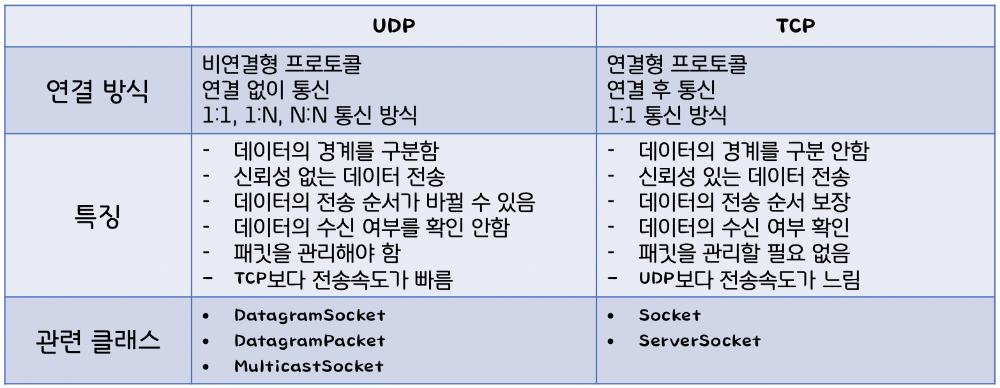

# TCP와 UDP
* 목차
    + [UDP](#UDP)
    + [TCP](#TCP)
    + [3-way handshake](#3-way-handshake)
    + [4-way handshake](#4-way-handshake)

## TCP와 UDP 차이점 한 눈에 보기

 
 

## UDP

* 비연결형 프로토콜
    + 비연결형 프로토콜이 무엇이냐?? -> 즉, **일방적으로** 데이터를 전달하기만 함
    + 그래서 `TCP`보다 **속도가 빠름**.
* `UDP`는 흐름제어, 오류제어 또는 손상된 세그먼트의 수신에 대해 재전송을 하지 않습니다.
    + 이 모두가 사용자 프로세스의 몫이다.
    + 이게 무슨 말이냐????
        * 즉, 파일이 전달되는 과정에서 손상이 되거나 전달이 제대로 이루어지지 않아도 `UDP`는 <u>책임지지 않아요</u>.
        * 만약 요청/응답이 손실된다면, Client는 타임 아웃⏱ 되고 다시 시도할 수 있으면 됩니다.
* 코드가 **간단**할 뿐만 아니라 `TCP`처럼 초기설정에서 요구되는 프로토콜보다 적은 메시지📩 가 요구됩니다.
* UDP를 사용한 예를 하나 들자면, `DNS`가 있습니다. 
    + `DNS`는 상황에 따라 UDP와 TCP를 사용하는데, 간단한 질의 및 응답에는 UDP를 사용합니다.
    + 어떤 호스트 네임의 IP주소를 찾아야하는 프로그램은 `DNS` 서버로 호스트 네임을 포함한 UDP 패킷을 보냅니다. 그러면, 이 서버는 호스트의 IP주소를 포함한 UDP 패킷으로 응답합니다. 
    + 사전에 설정이 필요하지 않으며 그 후에 해제가 필요하지 않습니다.
        * 이게 무슨 말일까??? DNS 서버는 뭐지??
            + DNS : Domain Name Service
            + 도메인에 연결된 서버 IP를 찾아주는 역할

 
 

## TCP

* Transmission Control Protocol
* 대부분 인터넷 응용 분야들은 **신뢰성**과 **순차적인 전달**을 필요로 하지만, `UDP`로는 만족시킬 수 없어 탄생한 프로토콜이 `TCP`입니다.
    + **신뢰성**이 없는 인터넷을 통해 종단 간에 신뢰성 있는 **바이트 스트림**을 전송하도록 특별 설계되었습니다.
* `TCP` 서비스는 송신자와 수신자 보두가 **소켓**이라고 부르는 종단점을 생성함으로써 이루어집니다.
* 모든 `TCP` 연결은 전이중(full-duplex), 점대점(point to point) 방식입니다.
    + 전이중 : 전송이 **양방향**으로 **동시에** 일어날 수 있음을 의미
    + 점대점 : 각 연결이 정확히 2 개의 종단점을 가지고 있음을 의미
* **`TCP`는 멀티캐스팅이나 브로드캐스팅을 지원하지 않습니다.**

 

* 특징
    1. **Connection oriented**
        + <u>연결지향형</u>
        + 응용 프로그램이 데이터를 교환하기 전에 먼저 응용 프로그램 간 연결을 성립한 후 전송을 시작합니다.
    2. **Bidirectional byte stream**
        + <u>양방향 데이터</u> 통신
        + <u>바이트 스트림</u> 사용
    3. **In-order delivery**
        + 송신자가 **보낸 순서**대로 수신자가 데이터를 받습니다.
        + 순서를 표시하기 위해 32-bit 정수 자료형을 사용합니다.
    4. **Reliability through ACK**
        + 데이터를 송신하고 수신자로부터 ACK를 받지 않으면, 송신자 TCP가 데이터를 **재전송**합니다.
        + 따라서 송신자 TCP는 수신자로부터 ACK를 받지 않은 데이터를 보관합니다. (buffer unacknowledged data)
    5. **Flow control**
        + 송신자(TCP)는 수신자가 **받을 수 있는 만큼** 데이터를 전송합니다.
    6. **Congestion control**
        + 네트워크 정체를 방지하기 위해 receive window와 별도로 congestion window를 사용합니다.
        + Flow control과 달리 송신자가 단독으로 구현합니다.

 

* `TCP`에서 연결 설정(connection establishment)은 `3-way handshake`를 통해 이루어집니다.
    + 그렇다면 `3-way handshake`는 뭐고 `4-way handshake`는 뭐지???? 아래를 볼까요??

 
 

### 3-way handshake

TCP의 3-way handshake는 TCP/IP프로토콜을 이용해서 통신을 하는 응용 프로그램이 데이터를 전송하기 전에 번저 **정확한 전송을 보장하기 위해 상대방 컴퓨터와 사전에 세션을 수립하는 과정을 의미**합니다.

 

* Client -> Server : TCP SYN
* Server -> Client : TCP SYN ACK
* Client -> Server : TCP ACK

> SYN : synchronize sequence numbers
> ACK : acknowledgment

 

* 역할
    + 양쪽 모두 데이터를 전송할 준비가 되었다는 것을 보장하고, 실제로 데이터 전달이 시작하기전에 한 쪽에서 다른 쪽이 준비되었다는 것을 알 수 있도록 합니다.
    + 양쪽 모두 상대편에 대한 초기 순차일련변호를 얻을 수 있도록 합니다.

 

* 과정

 

**[STEP 1]**

A(클라이언트)는 B(서버)에 접속을 요청하는 `SYN 패킷`을 보낸다. 이때 A(클라이언트)는 SYN 을 보내고 SYN/ACK 응답을 기다리는 `SYN_SENT 상태`가 되는 것이다.

 

**[STEP 2]**

B(서버)는 `SYN 요청`을 받고 A(클라이언트)에게 요청을 수락한다는 ACK 와 SYN flag 가 설정된 패킷을 발송하고, A가 다시 ACK으로 응답하기를 기다린다. 이때, B(서버)는 `SYN_RECEIVED 상태`가 된다.

 

**[STEP 3]**

A(클라이언트)는 B(서버)에게 `ACK`을 보내고 이후로부터는 연결이 이루어지고 데이터가 오가게 되는것이다. 이때의 B(서버) 상태가 `ESTABLISHED` 이다.

 

* 위와 같은 방식으로 통신하는 것이 **신뢰성 있는 연결**을 맺어 준다는 `TCP`의 `3 Way handshake` 방식이다.

 
 

### 4-way handshake

3-Way handshake는 TCP의 연결을 **초기화** 할 때 사용한다면, `4-Way handshake`는 **세션을 종료**하기 위해 수행되는 절차입니다.

 

* 과정

 

**[STEP 1]**

클라이언트가 연결을 종료하겠다는 `FIN 플래그`를 전송한다.

 

**[STEP 2] **

서버는 일단 확인메시지를 보내고 자신의 통신이 끝날때까지 기다리는데 이 상태가 `TIME_WAIT 상태`다.

 

**[STEP 3]**

서버가 통신이 끝났으면 연결이 종료되었다고 클라이언트에게 `FIN 플래그`를 전송한다.

 

**[STEP 4]**

클라이언트는 확인했다는 메시지를 보낸다.

 

* 그런데 만약 `Server에서 FIN을 전송하기 전에 전송한 패킷이 Routing 지연이나 패킷 유실로 인한 재전송 등으로 인해 FIN 패킷보다 늦게 도착하는 상황`이 발생한다면 어떻게 될까요?
    + Client에서 세션을 종료시킨 후 뒤늦게 도착하는 패킷이 있다면 이 패킷은 Drop되고 데이터는 유실될 것입니다. 
* 이러한 현상에 대비하여 Client는 Server로부터 FIN을 수신하더라도 일정시간(디폴트 240초) 동안 세션을 남겨놓고 **잉여 패킷을 기다리는 과정**을 거치게 되는데 이 과정을 `TIME_WAIT` 라고 합니다.

 
 
 
 

> **Reference**
> * [NAVER D2](https://d2.naver.com/helloworld/47667)
> * [TCP/UDP 특징 및 차이점](https://bscnote.tistory.com/53)
> * [3-way handshake & 4-way handshake](https://mindnet.tistory.com/entry/%EB%84%A4%ED%8A%B8%EC%9B%8C%ED%81%AC-%EC%89%BD%EA%B2%8C-%EC%9D%B4%ED%95%B4%ED%95%98%EA%B8%B0-22%ED%8E%B8-TCP-3-WayHandshake-4-WayHandshake)