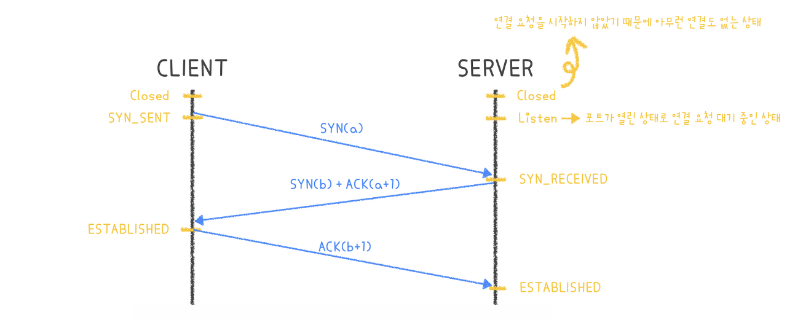
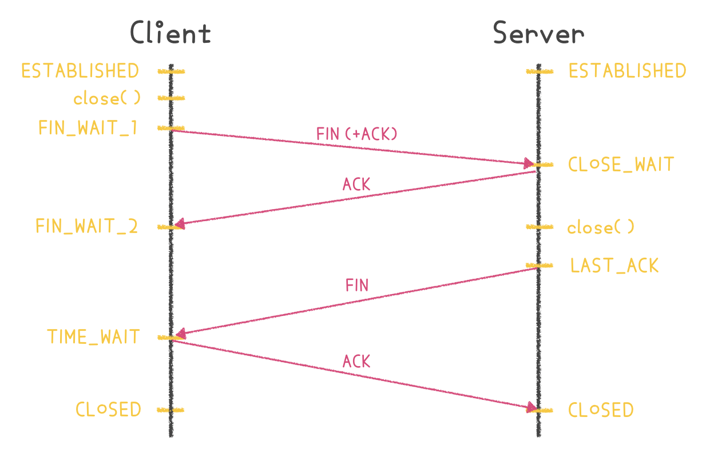

# TCP 동작방식
웹 서비스 동작 방식을 보면, 사용자가 url을 입력했을 때 도메인 주소를 이용하여 DNS에서 IP 주소를 얻어오고, 그렇게 얻어온 IP 주소를 웹 데이터 형식으로 변하여 TCP 통신을 통해 웹 서버와 주고받게 됩니다. 이때 TCP 통신을 하기 위해 `3-way handshake`로 접속을, `4-way handshake`로 접속 해제를 해주게 됩니다.

오늘은 `TCP 동작 방식`을 알아보기 위해 3-way, 4-way handshake 과정을 알아보겠습니다.

## Socket 생성
Client는 운영체제에 socket( ) 시스템 콜을 이용하여 소켓을 생성합니다. 운영체제는 소켓의 정보를 저장하기 위해 메모리 영역을 할당하고, 소켓 정보를 저장합니다.

## 3-way handshake
* Client는 Server와 연결하기 위해 `3-way handshake를 통해 연결 요청`을 하게 됩니다.
* 우리가 일반적으로 생각하는 Client와 Server는 모두 서로 연결 요청을 먼저 할 수 있기 때문에, **연결 요청을 먼저 시도한 요청자를 Client**로, 연결 요청을 받은 **수신자를 Server**쪽으로 생각하고 보시면 될 것 같습니다. 
* 이때 아래 그림에서 `a`는 *Sequence Number*, `b`는 *Acknowledgment Number*가 됩니다.
* ACK : 동기화 요청에 대한 답변 - Client의 Sequence Number에 +1을 하여 ACK로 돌려줍니다.

1. `SYN(a)` Client에서 Server에게 **SYN(a)**를 보냅니다. 이 때 Client의 상태는 SYN을 보냈다는 `SYN_SENT 상태`로 바뀌게 됩니다.
2. `SYN(b) + ACK(a+1)` Server에서는 SYN을 받았다는 `SYN_RECEIVED 상태`로 바뀝니다. 그리고 나서 Client에게 잘 받았다는 응답의 **ACK(a+1)과 SYN(b)**를 보냅니다.
3. `ACK(b+1)` Client에서는 상호 연결이 된 상태의 `ESTABLISHED 상태`로 바뀝니다. 그리고 나서 Server에게 **ACK(b+1)**을 보냅니다.
4. `ESTABLISHED` Server에서는 ACK를 받은 후에 `ESTABLISHED 상태`로 바뀌게됩니다.

## 4-way handshake
* 연결 종료 요청 또한 우리가 일반적으로 생각하는 Client와 Server 모두 먼저 종료 요청을 보낼 수 있기 때문에 먼저 요청한 쪽을 Client, 요청을 받은 쪽을 Server라고 생각하고 보시면 됩니다.
* 아래 그림에서 처음 보내는 종료 요청인 `1. FIN` 패킷에 실질적으로 ACK가 포함되어 있는 것을 알 수 있는데, 이는 `Half-Close 기법`을 사용하기 때문입니다.
    + 즉, 연결을 종료하려고 할 때 완전히 종료하지 않고 반만 종료합니다.
    + Half-Close 기법을 사용하면 종료 요청자가 처음 보내는 FIN 패킷에 승인 번호를 함께 담아서 보내게 되는데, 이때 승인 번호의 의미는 **"일단 연결은 종료할건데 귀는 열어둘게. 이 승인 번호까지 처리했으니까 더 보낼 거 있으면 보내"** 가 됩니다.
    + 이후 수신자가 남은 데이터를 모두 보내고 나면 다시 요청자에게 FIN 패킷을 보냄으로써 모든 데이터가 처리되었다는 신호 `3. FIN`를 보냅니다. 그럼 요청자는 그때 나머지 반을 닫으면서 좀 더 안전하게 연결을 종료할 수 있게 됩니다.

1. `FIN (+ACK)` 서버와 클라이언트가 TCP 연결이 되어있는 상태에서 클라이언트가 접속을 끊기 위해 **close( )를 호출**합니다. 클라이언트가 close( )를 호출하면서 서버에게 FIN 패킷을 보내게 되는데, 이때 FIN 패킷에 실질적으로는 ACK도 포함되어 있습니다. 그리고 나서 클라이언트는 `FIN_WAIT_1 상태`로 들어갑니다.
2. `ACK` 서버는 클라이언트에게 응답을 보내고 `CLOSE_WAIT 상태`에 들어갑니다. 그리고 **아직 남은 데이터가 있다면 마저 전송을 마친 후에 close( )를 호출**합니다.
3. `FIN_WAIT_2` 클라이언트에서는 서버에서 ACK를 받은 후에 서버가 남은 데이터 처리를 끝내고 FIN 패킷을 보낼 때까지 기다리게 됩니다.
4. `FIN` 서버는 이제 모든 데이터 처리가 끝났다고 종료에 합의 한다는 뜻으로 클라이언트에게 FIN 패킷을 보낸 후에 승인 번호를 보내줄 때까지 기다리는 `LAST_ACK 상태`로 들어갑니다.
5. `ACK` 클라이언트는 서버에서 FIN 패킷을 받고 나서 다시 서버에게 ACK 응답을 보낸 후에 `TIME_WAIT 상태`로 들어가며 실질적인 종료 과정(**CLOSED**)에 들어가게 됩니다. 이때 TIME_WAIT 상태는 **의도치 않은 에러로 인해 연결이 데드락으로 빠지는 것을 방지**하는데, 만약 에러로 인해 종료가 지연되다가 타임이 초과되면 CLOSED로 들어갑니다.
6. `CLOSED` 서버는 ACK를 받고 `CLOSED 상태`로 들어가 종료하게 됩니다.

### Reference
* [TCP 통신 과정 및 비정상 종료(TCP 3,4-way handshake)](https://www.crocus.co.kr/1362)
* [TCP가 연결을 생성하고 종료하는 방법, 핸드쉐이크](https://evan-moon.github.io/2019/11/17/tcp-handshake/)