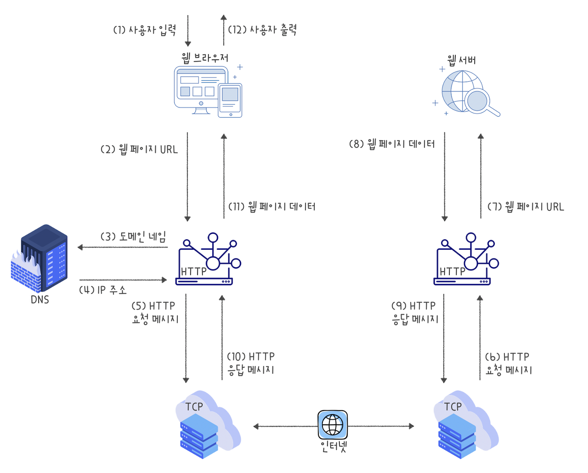

# Web의 동작원리
이제는 생활에서 빼놓을 수 없는 인터넷. 하지만 정작 웹 사이트가 어떻게 동작하는지 아시나요?

 

그래서 오늘은 웹 URL을 입력하는 것부터 해당하는 웹 사이트가 나에게 보여질 때까지 어떤 과정이 일어나는지 알아보았습니다.

* `(1), (2)` 사용자가 웹 브라우저를 통해 찾고 싶은 웹 페이지의 **URL 주소를 입력**합니다.

* `(3)` 사용자가 입력한 URL 주소 중에서 도메인 네임 부분을 **DNS 서버에서 검색**합니다.
    + 도메인 네임이란, 웹 사이트의 주소를 찾기 위한 고유한 문자형 주소체계입니다. 원래 컴퓨터나 통신장비 간 통신에 최적화된 주소체계는 IP 주소지만, IP 주소는 숫자로 이루어져 있어서 사람이 기억하기 어렵기 때문에 도메인을 사용합니다.

* `(4)` DNS 서버에서 해당 도메인 네임에 해당하는 **IP 주소를 찾아 사용자가 입력한 URL 정보와 함께 전달**합니다.

* `(5), (6)` 웹 페이지 URL 정보와 전달받은 IP 주소는 HTTP 프로토콜을 사용하여 **HTTP 요청 메시지로 생성**됩니다. 이렇게 생성된 HTTP 요청 메시지는 **TCP 프로토콜을 사용**하여 인터넷을 거쳐 해당 IP 주소의 컴퓨터로 전송됩니다.

* `(7)` 이렇게 도착한 HTTP 요청 메시지는 HTTP 프로토콜을 사용하여 **웹 페이지 URL 정보로 변환**됩니다.

* `(8)` 웹 서버는 도착한 웹 페이지 **URL 정보에 해당하는 데이터를 검색**합니다.

* `(9), (10)` 검색된 웹 페이지 데이터는 또 다시 HTTP 프로토콜을 사용하여 **HTTP 응답 메시지로 생성**됩니다. 이렇게 생성된 HTTP 응답 메시지는 **TCP 프로토콜을 사용**하여 인터넷을 거쳐 원래 컴퓨터로 전송됩니다.

* `(11)` 도착한 HTTP 응답 메시지는 HTTP 프로토콜을 사용하여 다시 **웹 페이지 데이터로 변환**됩니다.

* `(12)` 변환된 웹 페이지 데이터는 **웹 브라우저에 의해 출력**되어 사용자에게 보여집니다.

## Reference
* [웹의 동작 원리](http://www.tcpschool.com/webbasic/works)