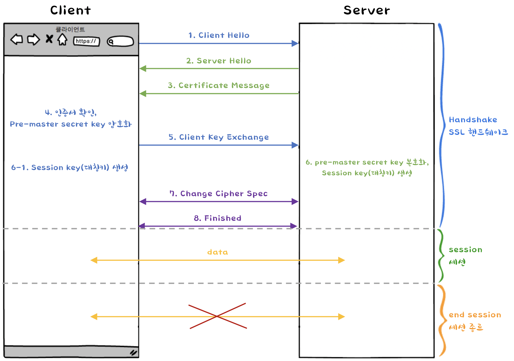

# HTTP와 HTTPS
* 목차
  * [HTTP와 HTTPS 차이점](#http와-https-차이점)
  * [SSL과 TLS 차이점](#ssl과-tls-차이점)
  * [TLS 통신 과정](#SSL/TLS-통신-과정(동작-방식))
  * [비대칭키/대칭키 암호화 방식](#(추가)-비대칭키/대칭키-암호화-방식)

 
 

## HTTP와 HTTPS 차이점

| HTTP | HTTPS |
| :---: | :---: |
| HyperText Transfer Protocol | HyperText Transfer Protocol over Secure Socket Layer(SSL) |
| 인터넷에서 사용하는 웹 서버와 사용자의 인터넷 브라우저 사이에 문서를 전송하기 위한 통신 규약 | |
| 포트번호 : 80 | 포트번호 : 443 |
| **암호화가 전혀 되어 있지 않아**, 그냥 텍스트 그대로 전송 | 소켓 통신에서 일반 텍스트를 이용하는 대신에, **TLS 프로토콜**을 통해 세션 데이터를 **암호화** |
| wireshark와 같은 패킷캡쳐 프로그램으로 패킷캡쳐를 해보면 정보가 그대로 노출되어 있는 것을 볼 수 있습니다. | 패킷을 암호화하여 전송하기 때문에 패킷캡쳐를 해보아도 암호화된 내용만 보이게 됩니다. |
| HTTPS보다 트래픽이 적게 발생 | 설치 및 인증서를 유지하는 데에 추가비용 발생 |
| | HTTPS의 암호화는 Transport 계층에서 이루어지게 됩니다. (TLS - Transport Layer Security : SSL3.0을 기반) |

 

* 모든 사이트에서 HTTPS를 사용하게 되면 서버에 과부화가 걸릴 수 있기 때문에, 대부분 **중요한 사이트는 HTTPS로 관리하고 나머지 일반적인 사이트는 HTTP로 세팅**합니다.
* ~~SSL~~은 공개키 암호화 방식과 공개키의 단점을 보완한 대칭키 암호화 방식을 함께 사용한다. (공개키 방식은 느리다는 단점이 있다.)

 

> 공개키방식으로 대칭키를 전달하고, 서로 공유된 대칭키를 가지고 통신하게 된다.

 
 
 

## SSL과 TLS 차이점

대부분 HTTP와 HTTPS를 검색하면, HTTPS는 HTTP에서 SSL/TLS 인증서 개념이 더해진 HTTP보다 보안이 더 강한 프로토콜이라고 나옵니다.  

그럼 **SSL**과 **TLS**의 차이점은 무엇일까요?

  * **SSL (Secure Sockets Layer)** : Netscape 사에서 개발
  * **TLS (Transport Layer Security)** : IETF 사에서 개발

 
 

SSL과 TLS 모두 사용자와 웹 브라우저 간 통신을 암호화하는데 사용하는 프로토콜입니다.  

TLS는 SSL과 비슷하다고 보면 되는데 TLS는 SSL3.0을 기반으로 개선된 신규 모델 프로토콜로, **SSL은 더이상 사용되지 않고 TLS가 사용됩니다.**

하지만 SSL이라는 단어가 익숙해서 SSL와 TLS라는 단어가 혼용되서 사용될 때가 많은데, 그냥 **HTTPS에는 TLS가 사용**된다고 보면 됩니다.  
 
TLS는 <u>**공개키와 개인키를 교환하여 보안 세션을 생성한 후 통신을 암호화 하는 방식**</u>으로 이루어집니다.  

SSL와 TLS는 TCP/IP 네트워크를 사용하는 통신에 적용되며, 통신 과정에서 전송계층 종단 간 보안과 데이터 <u>무결성</u>을 확보할 수 있게 합니다.

<u>무결성</u> : 정보가 변형되지 않고 그대로 전달되는 성질

 

---

 

## SSL/TLS 통신 과정(동작 방식)

 
 

### 🤝 handshake 🤝

* handshake는 실제로 암호화 자체를 수행하는 것이 아니라, 공유되는 비밀 및 사용될 암호화 유형을 결정하는 절차를 진행합니다.
* 암호화된 HTTP 메시지를 교환하기 전에 Client와 Server는 SSL 핸드쉐이크를 진행한다.
* Handshake의 목적
  + 프로토콜 버전 번호 교환
  + 양쪽이 알고 있는 pre-master secret key 생성 및 교환
  + 양쪽의 신원 인증
  + 채널을 암호화 하기 위한 임시 세션키 생성

 
 

**1. Client Hello 👋**
  * 이 메시지에는 client에서 가능한 TLS 버전, 서버 도메인, 세션 식별자, 암호 설정 등의 정보가 포함된다.
  * client가 생성한 랜덤 데이터 A도 전송된다.

**2. Server Hello 👋**
  * 이 메시지에는 Client Hello 메시지의 정보 중 Server에서 사용하기로 결정한 TLS 버전, 세션 식별자, 암호 설정 등의 정보가 포함된다.
  * Server가 생성한 랜덤 데이터 B도 전송된다.

**3. Certificate Message 📩**
  * 공개키(RSA 암호용)가 포함된 서버 인증서 전송
  * 이 인증서는 CA에서 발급받은 것이며, Server가 신뢰할 수 있는 자 임을 인증합니다.
    + CA(Certificate Authority) : 디지털 인증서를 제공하는 공인된 기업
  * 전송이 끝나면 Server Hello Done 메시지 전달

**4. 인증서 확인, pre-master secret key 암호화 🔐**
  * Client는 Server에게 전달받은 인증서를 검증합니다.  
    (유효기간이 만료되지 않았는지, 신뢰할 수 있는 인증 기관에서 발급되었는지, 그 인증서가 해당 서버에게 발급된 인증서가 맞는지 등을 확인합니다)
  * Client는 랜덤 데이터 A와 B를 조합해서 세션키(대칭키)로 사용될 임의의 pre-master secret key를 생성한 뒤, Server가 보낸 인증서에 포함된 공개키를 사용하여 pre-master secret key를 암호화 합니다.
  
**5. Client Key Exchange 🔑**
  * 공개키로 암호화된 pre-master secret key 전송

**6. pre-master secret key 복호화, Session Key (대칭키) 생성 🔑**
  * Client에게 받은 암호화된 pre-master secret key를 Server 자신만 알고 있는 개인키로 복호화하여 pre-master secret key를 얻어내고, 이것을 이용해서 master secret key를 생성해냅니다.
  * 이 master secret key를 통해 Session Key (대칭키)를 생성합니다.
  * 이 세션키(대칭키)는 앞으로 Server와 Client 간의 통신을 암호화하는 데 사용될 것입니다.
  * Client 또한 같은 pre-master secret key를 사용하여 Server와 같은 Session Key를 가지게 됩니다. ( 대칭 키 )

**7. Change Cipher Spec 📩 📬**
  * 서로에게 앞으로 모든 통신 내용은 세션키(대칭키)로 암호화하여 통신할 것이라고 메시지를 보내 알려줍니다.
  
**8. Finished 🗣 🙌**
  * 그리고 나서 Finished 메시지를 보내 각자의 Handshake 과정이 끝났음을 알립니다.

 
 

### session
이후 세션키를 활용한 대칭키 암호화 방식으로 **Server와 Client**가 데이터를 주고 받습니다.

 
 

### end session
데이터의 전송이 끝나면 SSL통신이 끝났음을 서로에게 알려줍니다.   
이때, 세션키🔑를 폐기합니다.

 
 

> 공개키 암호방식(비대칭 암호화)은 대칭키 방식보다 안전하지만, 어려운 수학적 문제를 수반하기 때문에 과정이 복잡하고  
> 그만큼 시간도 오래 걸릴 뿐만 아니라 많은 컴퓨팅 리소스를 필요로 합니다.  
> 만약 커뮤니케이션 session 상의 모든 정보를 다 비대칭 암호화를 사용해 암호화하려 한다면 컴퓨터가 버텨내지 못할 것입니다.  
> 그래서 TLS는 커뮤니케이션 세션 시작부분에만 비대칭 암호화를 사용하여 이 문제를 피했습니다.  
>   
> 따라서 노출되면 큰일나는 대칭키를 만들어 주고받는 과정은 공개키 암호방식을 이용하고,  
> 주고받은 대칭키로 통신이 이루어집니다.  

 

---

 

## (추가) 비대칭키/대칭키 암호화 방식

먼저, 공개키/개인키 암호화 방식(비대칭키 방식)을 간단하게 살펴보겠습니다.
 
A와 B의 공개키가 각각 PUa, PUb라고 하고, 개인키가 각각 PRa, PRb라고 할 때, A가 B의 공개키 PUb로 암호화한 것은 B만 알고 있는 개인키 PRb로만 복호화가 가능합니다.  

마찬가지로 B가 A의 공개키 PUa로 암호화한 것은 A만 알고 있는 개인키 PRa로만 복호화가 가능합니다.  

반대로 생각하면 A가 자신만 알고 있는 개인키 PRa로 암호화 한다면, 모든 사람들은 A의 공개키인 PUa로 복호화하여 A가 암호화한 것을 볼 수 있습니다.
 
 
그럼 왜 모든 사람들이 볼 수 있도록 **개인키🔑**로 암호화🔐 할까요?
 
 
이는 보안의 기능이 아닌, **자신을 인증할 수 있는 하나의 방식**이 되기 때문입니다.  

따라서 개인키로 암호화 하는 예로 전자 서명을 들 수 있습니다.
 
SSL/TLS 동작 방식에서도 Server가 Client에게 인증서와 함께 건내준 공개키를 이용해서 Client는 그 인증서가 신뢰받는 기관에서 Server에게 준 것이라는 것을 검증할 수 있는 것입니다.  
그리고 Client가 대칭키를 만드는데 활용되는 pre-master secret key를 그 공개키로 암호화 하게 되면, 이것은 Server만 알고 있는 개인키로만 복호화할 수 있게 됩니다.

그렇게 해서 pre-master secret key는 Server와 Client만 알 수 있도록 비대칭키 암호화 방식으로 주고받게 되는 것입니다.
 
이렇게 주고 받은 pre-master secret key를 통해 Server와 Client가 각각 같은 Session Key를 생성할 수 있게 되고, 이 세션키를 이용한 암호화 방식(대칭키 암호화 방식)을 통해 통신을 이루게 됩니다.

 
 
 
 

> **Reference**  
> * dany-it.tistory.com/96?category=286604  
> * blog.naver.com/PostView.nhn?blogId=sung_mk1919&logNo=221598350824&categoryNo=0&parentCategoryNo=0&viewDate=&currentPage=1&postListTopCurrentPage=1&from=postView  
> * wayhome25.github.io/cs/2018/03/11/ssl-https/  
> * naleejang.tistory.com/216  
