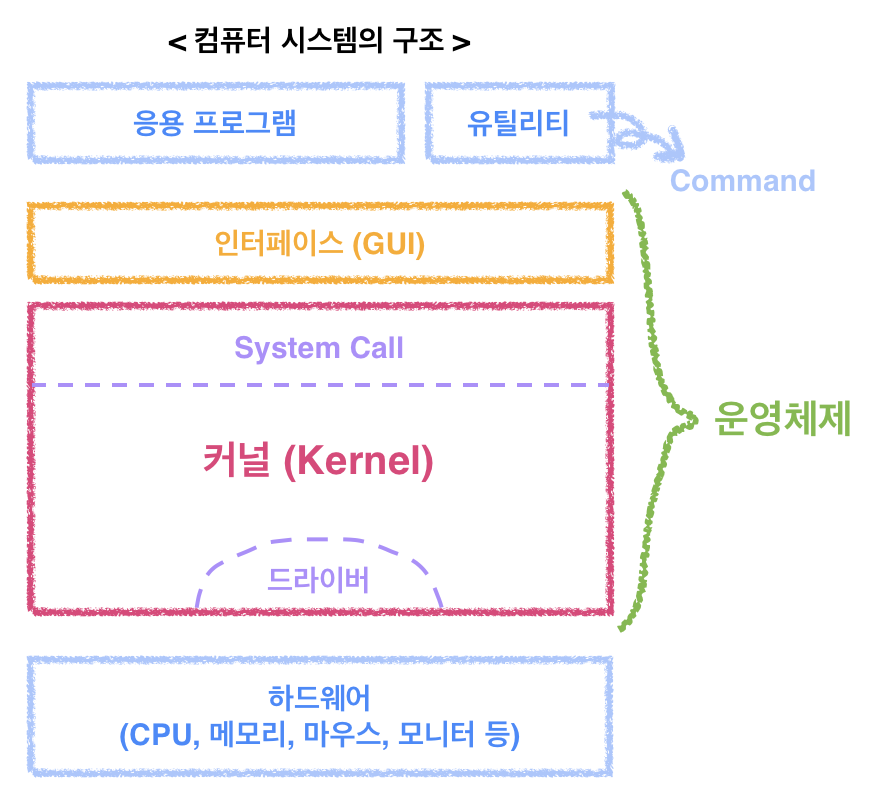
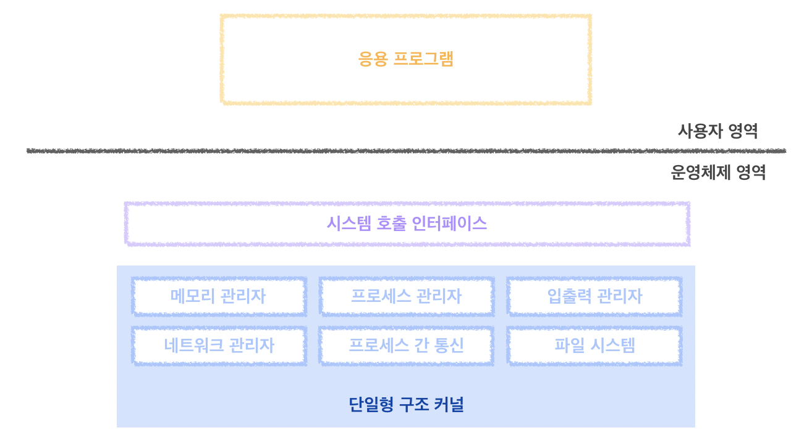
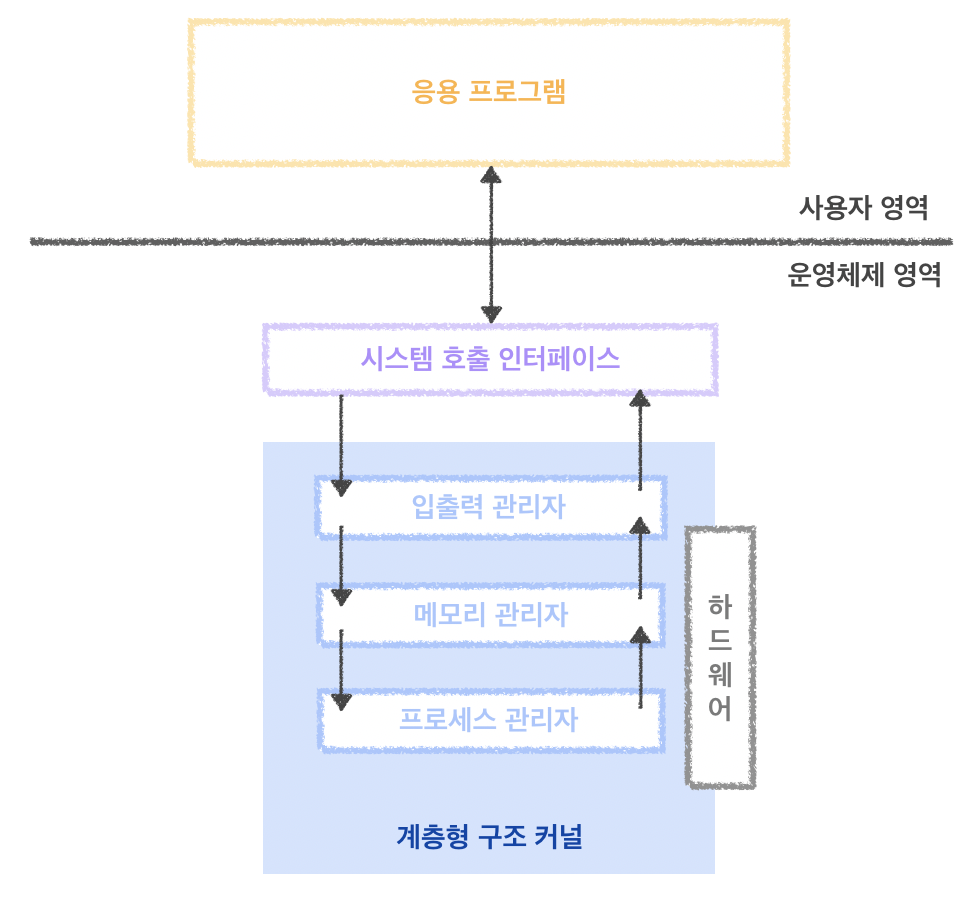
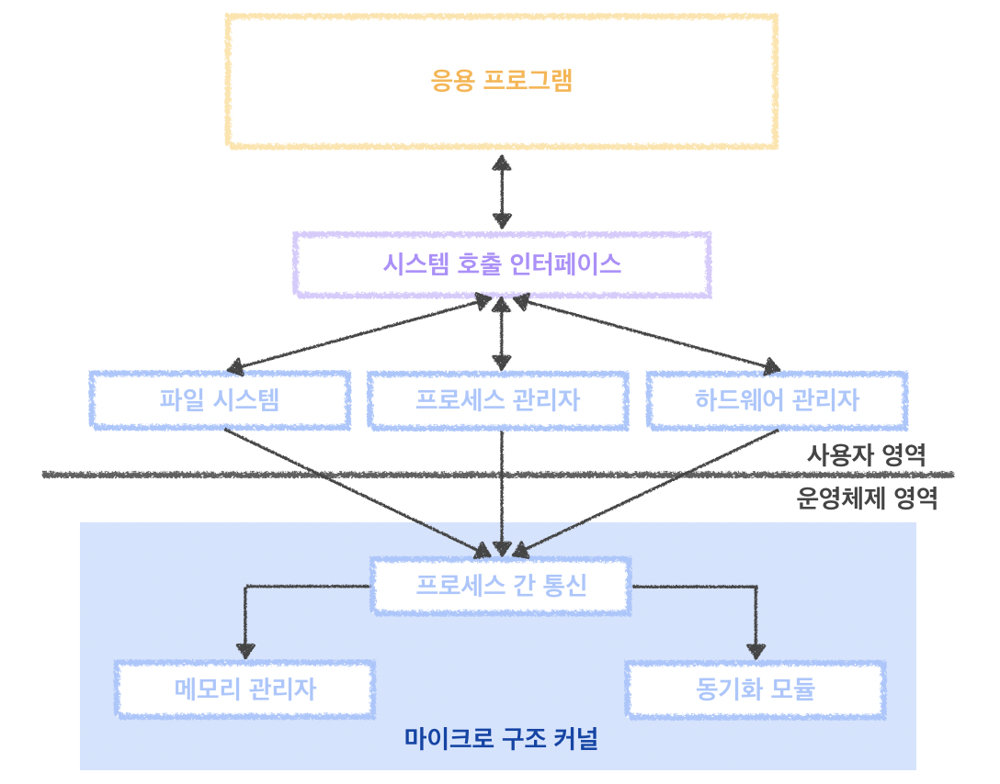

우리가 항상 운영체제를 공부하다 보면 자주 볼 수 있는 단어가 있다.

### 바로, `커널(Kernel)` 이다.

뭐만 하면 커널에 의해서 관리된다. 커널에 의해 보호된다. 어쩌구 저쩌구.....

도대체 커널이 뭐길래, 이렇게 자주 언급될까???

 
  

### `커널`이란,

프로세스/메모리/저장장치/입출력 시스템 등을 관리하는 **운영체제의 핵심적인 기능을 모아놓은 프로그램**이다.

그만큼 **운영체제의 핵심**이라고 할 수 있으며, <u>운영체제의 성능은 커널이 좌우<u/>하게 된다.

컴퓨터가 부팅하는 순간 커널 코드가 메모리에 올라가고, 다른 프로그램과 다르게 **항상 메모리에 상주(Memory Resident)**한다.

  

> 여기서 잠깐 운영체제를 말하자면,
>
> 운영체제는 크게 `커널`과 `인터페이스`로 나눌 수 있는데 **인터페이스**는 <u>커널에 사용자의 명령을 전달하고 실행 결과를 사용자에게 알려주는 역할<u/>을 한다. 운영체제는 커널과 인터페이스를 분리하여 같은 커널에 다른 인터페이스를 장착한 형태로 제작할 수 있다.
>
> **응? 분리한다니, 이건 무슨 말이지?** 한다면 유닉스 운영체제와 Mac OS X를 생각해보면 된다. 둘 다 유닉스계열의 커널을 사용하지만 서로 <u>인터페이스(유닉스는 쉘)<u/>가 다르다.
 
 

또한, 커널은 크게 **4가지 특성**을 가지고 있다.
* 위에서 말한 **Memory Resident**
* 자원을 보호하는 **보안성**
* 수많은 하드웨어가 접근가능하도록 하는 **추상화**
* 자원관리를 위한 **스케줄링**

 

그렇다면 다음 그림을 보면서 하나씩 살펴보자.

**(보안성)** 

커널은 사용자나 응용 프로그램으로부터 **컴퓨터 자원을 보호하기 위해 자원에 직접 접근하는 것을 차단**한다. 따라서 사용자나 응용 프로그램이 자원을 이용하기 위해서는 `System Call` 이라는 인터페이스를 이용하여 접근해야 한다. `System Call`은 **커널이 제공하는 시스템 관련 서비스를 모아넣은 것**으로, **함수 형태로 제공**된다.

 

**(추상화)** 

응용 프로그램과 커널의 인터페이스가 System Call이라면, **하드웨어와 커널의 인터페이스**는 `드라이버(Driver)`가 담당한다. 커널이 많은 종류의 하드웨어마다 그에 맞는 인터페이스를 다 개발하기 힘들다. 그래서 커널은 입출력의 기본적인 부분만 제작하고 **하드웨어의 특성을 반영한 소프트웨어**를 하드웨어 제작자에게 받아 커널이 실행될 때 함께 실행되도록 하는데, 이것이 바로 `디바이스 드라이버(Device Driver)`이다.
> 마우스, 키보드와 같이 간단한 디바이스 드라이버는 커널에 포함되어 있어, 하드웨어는 직접 커널과 연결되기도 한다.

 

**(스케줄링)** 

자원은 한정되어 있다. 한정된 자원을 여러 프로그램이 사용해야 하는데, 어떠한 한 프로그램이 그 자원을 오랫동안 사용하고 있다면 다른 프로그램은 계속해서 대기해야 할 것이다. 그래서 커널은 **한정된 자원을 효율적으로 관리하여 프로그램의 실행을 원활**하게 한다.

 

---

 

자, 우리는 지금까지 커널의 기본적인 개념과 특성을 살펴보았다.

여기까지 잘 따라왔다면 이번에는 **여러 구조의 커널**을 알아보자.

 

커널은 알다시피 여러가지 일을 한다.

프로세스 관리, 메모리 관리, 파일 시스템 관리, 입출력 관리, 프로세스 간 통신(IPC) 관리 등..

커널의 핵심 기능은 유기적으로 복잡하게 얽혀 있는데, 이러한 기능을 어떻게 구현하는 가에 따라 <u>단일형 구조 커널<u/>, <u>계층형 구조 커널<u/>, <u>마이크로 구조 커널<u/>로 구분된다.

 

### 1. 단일형 구조 커널 (Monolithic Architecture)

초창기 운영체제 구조로, 커널의 핵심 기능을 구현하는 모듈들이 **구분없이** 하나로 구성된다.

초기에 운영체제를 만들 때, 기능 구현하기에 바빴기 때문에 모듈을 분리하여 구현할 만한 여력이 없었다. 따라서 마치 함수를 거의 사용하지 않고 main( )에 모든 기능을 구현한 코드로 비유할 수 있다.

모든 모듈이 **하나로 묶여있기 때문에** <u>모듈 간의 통신 비용이 줄어들어 효율적인 운영이 가능하다<u/>는 장점이 있지만, 그만큼 단점이 매우 많다. 버그나 오류를 처리하기 어렵고, 운영체제의 여러 기능이 서로 연결되어 있어 **상호 의존성이 높다**. 즉, 기능상의 <u>작은 결함이 아주 치명적<u/>일 수 있다. 또한, **수정이 어렵**기 때문에 <u>다양한 환경의 시스템에 적용하기 어렵고(이식성이 낮음)<u/>, 크고 복잡한 운영체제를 구현하기 어렵다.

### 2. 계층형 구조 커널 (Layered Architecture)

단일형 구조 커널이 발전된 형태로, **비슷한 기능을 가진 모듈을 묶어서** 하나의 계층으로 만들고, 계층 간의 통신을 통해 운영체제를 구현하는 방식이다. 비슷한 기능을 모아 <u>모듈화<u/>했기 때문에 단일형 구조보다 **버그나 오류를 쉽게 처리**할 수 있다.

또한, 오류가 발생했을 때 전체 커널이 아닌 **해당 계층만 따로 수정**하면 되기 때문에 <u>디버깅</u>하기도 쉽다.

- 예 : 마이크로소프트의 윈도우를 비롯한 오늘날의 운영체제

> **< 여기서 잠깐!!! >**
> **모듈화란?**
> 거대한 문제를 작은 조각으로 나누어 다루기 쉽도록 하는 과정
> **디버깅이란?**
> 컴퓨터 프로그램 개발 과정 중에 발생하는 시스템의 논리적 오류나 비정상적 연산을 찾아내고, 그 원인을 밝히고 수정하는 작업과 과정

### 3. 마이크로 구조 커널 (Micro Architecture)

계속해서 모듈을 추가할 수 있는 계층형 구조 커널과 반대되는 개념을 가진다. 프로세스 관리, 메모리 관리, 프로세스 간 통신 관리 등 **가장 기본적인 기능만 제공**하며, **각 모듈은 독립적으로 작동**하기 때문에 하나의 모듈이 실패하더라도 전체 운영체제가 멈추지 않는다. 많은 컴퓨터에 이식하기 쉽고 커널이 가벼워 CPU 용량이 작은 시스템에도 적용 가능하다.

 

- 이 구조를 사용하는 대표적인 운영체제인 마하(Mach)는 Mac OS X와 iOS의 커널로 사용되어 유명해졌다.

 

---

 

우리는 지금까지 커널에 대해서 알아보았다. 커널과 연계된 개념(Context Switch, 스케줄링, IPC 등)이 너무 많아 어떤 범위까지 풀어써야 할 지 조금 고민되었지만, 이 포스트에서는 커널의 개념과 특성, 구조만을 다뤄보았다.

이 글을 잘 읽어보고 언젠가 누군가 커널이 무엇이냐고 물어본다면, 위의 내용을 떠올려보자.

  
 
 

> **Reference**
>
> ['쉽게 배우는 운영체제' - 한빛아카데미]()
> 
> [커널(kernel)](https://genesis8.tistory.com/241)